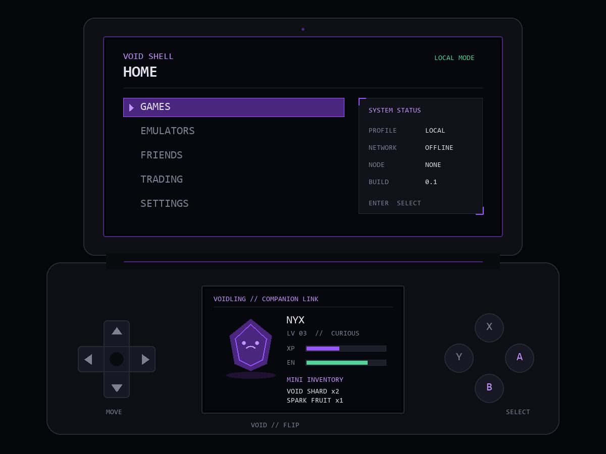

# Void Ecosystem

Void Ecosystem is a planned family of portable, local-first devices built around games, companions, multiplayer, trading, and creative tools. The project is currently in its first software phase: **Void Flip v0.1**.

## The devices

- **Void Flip** — a portable dual-screen handheld. It works independently and hosts games, emulators, social features, settings, and a Voidling companion.
- **Void Node** — an optional local server for neutral shared services such as larger multiplayer sessions and validated trading.
- **Void Deck** — a future cyberdeck-style device combining Flip and Node capabilities with development tools.

## Current phase: Void Flip v0.1

The current prototype is a Windows desktop simulator built with Python and Pygame Community Edition (imported as `pygame`). This package has Windows builds for Python 3.14. The simulator models the Flip's clamshell body, non-touch top display, smaller bottom companion display, D-pad, and face buttons. It is deliberately lightweight and hardware-agnostic so the interface can later move to Raspberry Pi-class hardware.



### Install

From the repository root:

```powershell
py -m pip install -r requirements.txt
```

### Run

```powershell
py flip/src/main.py
```

See [flip/README.md](flip/README.md) for controls and simulator details. Architecture and security direction live in [docs/architecture.md](docs/architecture.md) and [docs/security.md](docs/security.md).

## Project status

Void Flip v0.1 is an interface foundation, not a finished console or operating system. It does not yet include real games, emulators, accounts, networking, trading, persistent progression, or hardware input drivers.

Void credits are fictional in-device currency only. They will never be purchasable with real money or redeemable for real-world value.
