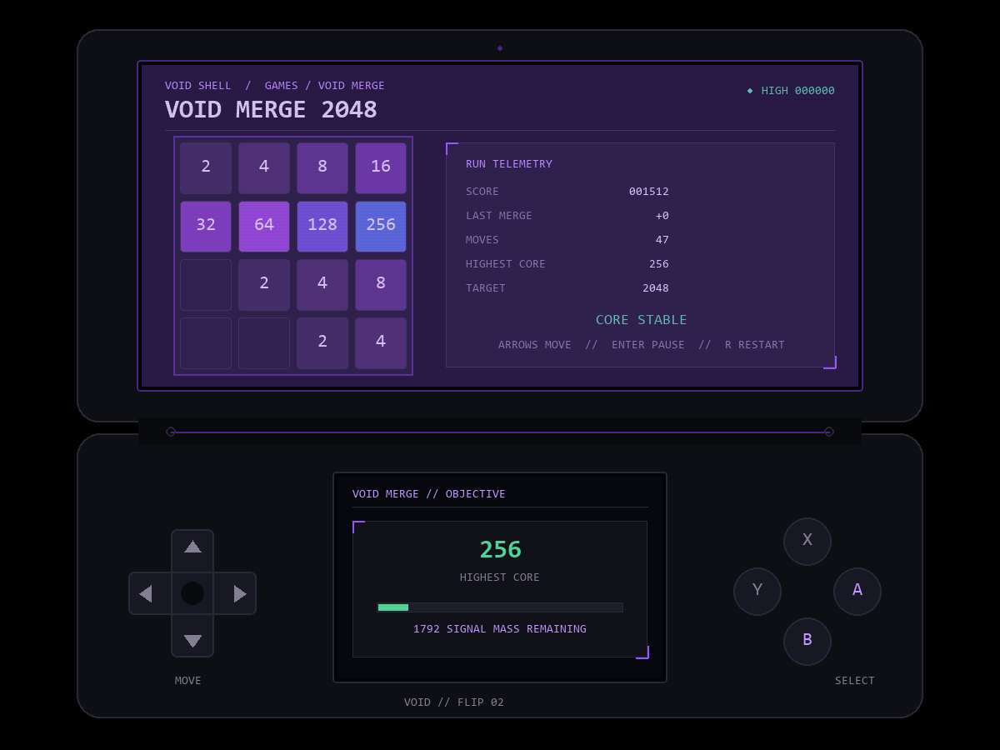

# Game production roadmap

The Games page is a production queue until each title reaches the playable quality bar below. Signal Catch was removed; it is not part of the product.

## Playable quality bar

A title becomes **Playable** only when it has a complete start/play/end/restart loop, held-input support where appropriate, pause and back behavior, increasing challenge, scoring or win rules, readable feedback on both screens, saved settings/high scores, and headless rule tests. Sound controls become mandatory once the platform introduces audio. A short animation or a button that only increments a number does not qualify.

## Build order

1. **Void Merge 2048 — playable:** deterministic board rules, correct one-merge-per-move behavior, spawning, scoring, win/loss detection, pause, restart, and saved high score. Animation, optional undo, and challenge modifiers remain polish work.
2. **Signal Serpent — playable:** grid movement, signal pickups, growth, wall/self/corruption collision, combo scoring, speed tiers, shard pickups, pause/restart, persistent statistics, and ecosystem rewards. Mission variants remain future polish.
3. **Blackglass Checkers** — forced captures, multi-jumps, kings, draw/win detection, local two-player, and a tested computer opponent.
4. **Maze Shift** — an original maze-chase game with shifting routes, enemy state machines, Voidling rescues, stages, lives, and bosses. It will use original names, art, maps, and behavior rather than copy Pac-Man assets.
5. **Starfall Wing** — a formation-based space shooter with held movement, projectiles, enemy patterns, upgrade routes, stages, and bosses. It will be an original work inspired by the genre rather than a Galaga asset clone.
6. **Relay Forge** — a clicker with timing/combo decisions, crafting routes, upgrades, reset balance, goals, and offline limits.
7. **Void Garden** — an AFK ecology with capped offline simulation, meaningful build choices, recovery rules, and no manipulative monetization.
8. **Constellation Hop** — Chinese-checkers-inspired rules, 2–6 local/network players, legal-move highlighting, turn recovery, and match synchronization.
9. **Void Party** — several complete short local multiplayer games sharing lobby, round, scoring, rematch, and controller systems.
10. **Community Games** — signed/permissioned packages, compatibility metadata, storage quotas, trust labels, and a safe failure boundary.

## Emulator bay

The intended monster-RPG setup is an emulator profile and launcher for legally user-supplied game files. The repository will not ship commercial ROMs, firmware, keys, or copyrighted game assets. Emulator integration comes after the platform has stable input, save, storage, and exit contracts.

The next full game implementation milestone is Blackglass Checkers. Games will continue one at a time so shared input and lifecycle code can mature instead of producing shallow shells.
