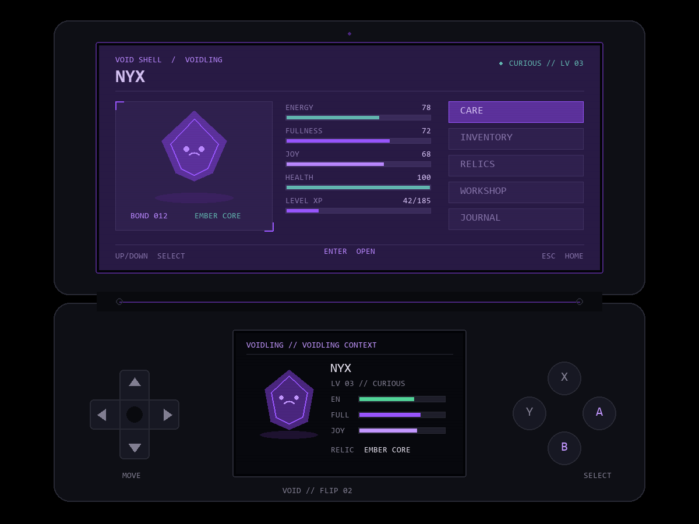
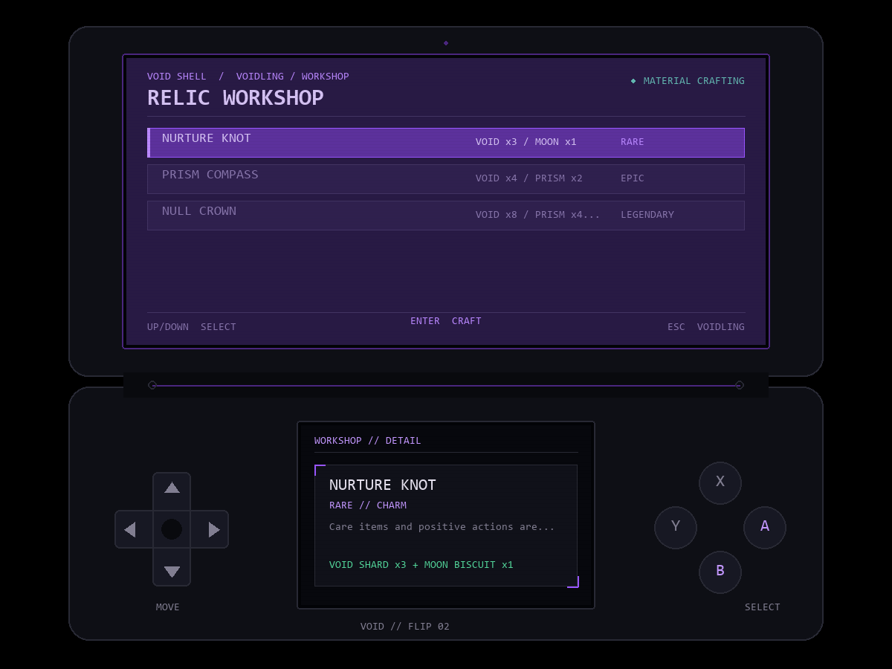

# Voidling system

Voidling is a local-first companion simulation, not a cosmetic status card. The platform owns its save data and rules so games cannot directly grant items, levels, or relic ownership.

## Core loop

Energy, fullness, and joy slowly decay while the app is open and for at most eight hours while it is closed. The cap prevents a long absence from destroying a profile. Very low fullness can reduce health. Care actions consume or restore needs, add bond and XP, and enforce short cooldowns so repeated key presses cannot bypass the loop.

- **Play:** spends energy/fullness for joy, bond, and XP.
- **Rest:** restores energy and health.
- **Train:** a costly, high-XP action.
- **Explore:** spends resources for XP and a chance at an item.
- **Comfort:** a low-cost way to improve joy and bond.

XP requirements grow by level. Relics can change XP gain, care strength, decay, maximum energy, bond gain, or exploration odds. Their effects are applied by the simulation rather than only displayed in the UI.

## Items and crafting

Food, medicine, and care items have concrete stat effects and are removed from inventory when used. Materials cannot be consumed as fake food. Void Shards and Prism Seeds instead feed workshop recipes for the Nurture Knot, Prism Compass, and Null Crown. Crafted relics become permanent owned equipment.

The journal tracks four deterministic achievements. A later milestone can add evolution forms, quests, more recipes, and named discoveries without changing the save boundary.

In v0.2, care, item use, exploration, crafting, games, achievements, daily quests, and the Void Market feed one shared progression loop. Flux remains separate from Void Shards and Prism Seeds: Flux buys Market goods, while materials craft relics.

## Persistence

The simulator atomically writes a versioned JSON profile to `%APPDATA%\VoidEcosystem\flip-profile.json` on Windows. It saves after meaningful actions, every 30 seconds, and at shutdown. Tests use isolated or disabled storage so development runs do not modify a player's profile.
